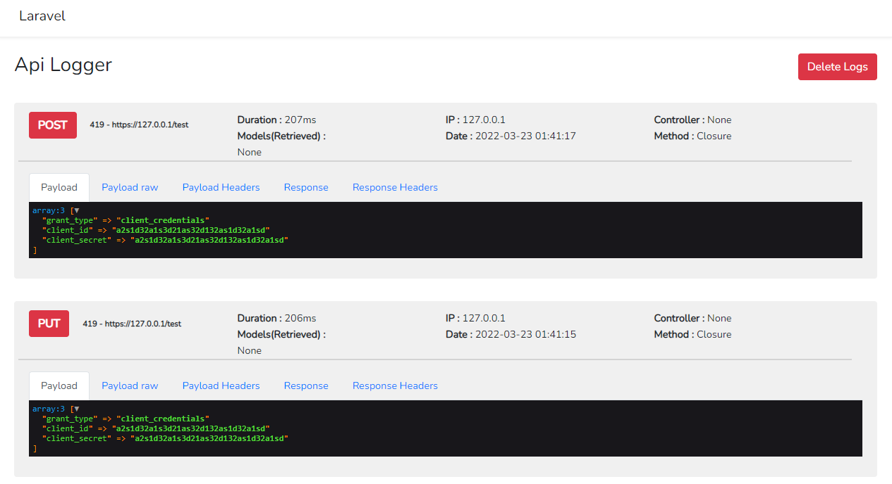

# API Logger

This is a small package that can helps in debugging api logs. It can log 
request method, url, duration, request payload, which models are retrieved, controller and method. 



##  Installation

1. Install the package via composer

```bash
composer require awt/apilogger @dev
```
## Usage

1.  Laravel 5.5 and higher uses Package Auto-Discovery, so doesn't require you to manually add
the ServiceProvider. If you use a lower version of Laravel you must register it in your 
_app.php_ file:

```bash
AWT\Providers\ApiLogServiceProvider::class
```

2. Publish the config file with:

```bash
php artisan vendor:publish --tag=config --provider="AWT\Providers\ApiLogServiceProvider"
```

The config file is called *apilogs.php*. Currently supported drivers are *db* and *file*

By default the logger will use *file* to log the data. But if you want to use Database for logging, migrate table by using

You can also configure which fields should not be logged like passwords, secrets, etc.

***You dont need to migrate if you are just using file driver***

```bash
php artisan migrate
```

3. Add middleware named ***apilogger*** to the route or controller you want to log data

```php
//in route.php or web.php
Route::middleware('apilogger')->post('/test',function(){
    return response()->json("test");
});
```

4. Dashboard can be accessible via ***yourdomain.com/apilogs***

## Clear the logs

You can permenently clear the logs by using the following command.
```bash
php artisan apilog:clear
```
## Implement your own log driver

1. Your driver class ***must*** implement ApiLoggerInterface for saving, retrieving and deleting the logs.
2. Your driver class may extends `AbstractLogger` class which provide helpful methods such as logData and mapArrayToModel.
3. Substitude in your new class name instead of `db` or `file` as the driver. eg: `\App\Apilogs\CustomLogger::class`

## Security
### Add Auth
In config/apilog.php you have 'route' option, you can change the prefix and add auth middleware or any other middleware
```php
'route'          => [
    'prefix'     => 'apilogs',
    'middleware' => null,//Can be change to ['auth'] or others
]
```


If you discover any security related issues, please email agwinthant@gmail.com instead of using the issue tracker.

## License

The MIT License (MIT). Please see [License File](LICENSE.md) for more information.
